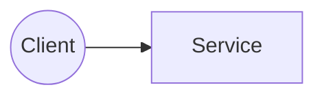

# Architecture Snapshot — gert-platform

- Generated: `2025-09-02T08:04:44.697112Z`

## Tech summary

```yaml
generated_at: 2025-09-02T08:04:44.697112Z
repo_name: gert-platform
path: /Users/gert/gert-platform
backend: None
frontend: None
infra:
  - docker-compose.yml
ci:
  - GitHub Actions
datastores:
  - PostgreSQL
  - Redis
```

## File tree (filtered)

```text
gert-platform/
├── .github/
│   ├── workflows/
│   │   ├── ci-backend.yml
│   │   └── ci-frontend.yml
│   └── .DS_Store
├── analyzer-portrait-of-talents/
│   ├── analyzer.py
│   ├── Dockerfile
│   ├── main.py
│   └── requirements.txt
├── archsnap_out/
│   ├── arch.md
│   ├── deps_backend.txt
│   ├── deps_frontend.txt
│   ├── files_index.csv
│   ├── summary.yaml
│   ├── tree.json
│   └── tree.txt
├── backend/
│   ├── logs/
│   │   ├── combined.log
│   │   └── error.log
│   ├── migrations/
│   │   └── 03_create_employees_table.sql
│   ├── src/
│   │   ├── config/
│   │   │   ├── crypto.config.js
│   │   │   ├── db.js
│   │   │   └── logger.js
│   │   ├── controllers/
│   │   │   ├── auth.controller.js
│   │   │   ├── company.controller.js
│   │   │   ├── employee.controller.js
│   │   │   └── surveyTemplate.controller.js
│   │   ├── middleware/
│   │   │   ├── auth.js
│   │   │   ├── authenticateToken.js
│   │   │   ├── checkRole.js
│   │   │   ├── errorHandler.js
│   │   │   ├── rateLimit.js
│   │   │   ├── validate.js
│   │   │   └── validation.js
│   │   ├── migrations/
│   │   ├── models/
│   │   │   ├── Company.js
│   │   │   ├── Employee.js
│   │   │   ├── SurveyAssignment.js
│   │   │   ├── SurveyResponse.js
│   │   │   ├── SurveyResult.js
│   │   │   ├── SurveyTemplate.js
│   │   │   └── User.js
│   │   ├── routes/
│   │   │   ├── auth.routes.js
│   │   │   ├── companies.routes.js
│   │   │   ├── employees.routes.js
│   │   │   ├── survey.routes.js
│   │   │   └── surveyTemplates.routes.js
│   │   ├── services/
│   │   │   └── notification.service.js
│   │   ├── tests/
│   │   ├── utils/
│   │   │   ├── encryption.service.js
│   │   │   └── pagination.js
│   │   ├── .DS_Store
│   │   ├── app.js
│   │   └── server.js
│   ├── .DS_Store
│   ├── .env
│   ├── .env.example
│   ├── .eslintrc.js
│   ├── Dockerfile
│   ├── init-db.sql
│   ├── package-lock.json
│   └── package.json
├── codepack_out/
│   ├── code.jsonl
│   ├── file_list.csv
│   ├── manifest.json
│   ├── prompt_user_en.md
│   ├── prompt_user_ru.md
│   └── README.md
├── docs/
│   ├── api/
│   ├── deployment/
│   ├── .DS_Store
│   ├── frontend_plan.txt
│   ├── technical_requirements.txt
│   ├── total_plan.txt
│   └── usefull.txt
├── frontend/
│   ├── public/
│   ├── src/
│   │   ├── App.tsx
│   │   └── main.tsx
│   ├── .DS_Store
│   ├── .eslintrc.js
│   ├── Dockerfile
│   ├── index.html
│   ├── package-lock.json
│   ├── package.json
│   ├── tailwind.config.js
│   └── vite.config.js
├── .dockerignore
├── .DS_Store
├── archsnap.py
├── codepack.py
├── docker-compose.yml
└── README.md
```

## High-level topology (heuristic)



## Dependency notes

- See `deps_backend.txt` and `deps_frontend.txt` for details.

## Next steps

- Feed `arch.md` and `summary.yaml` to your LLM for analysis.
